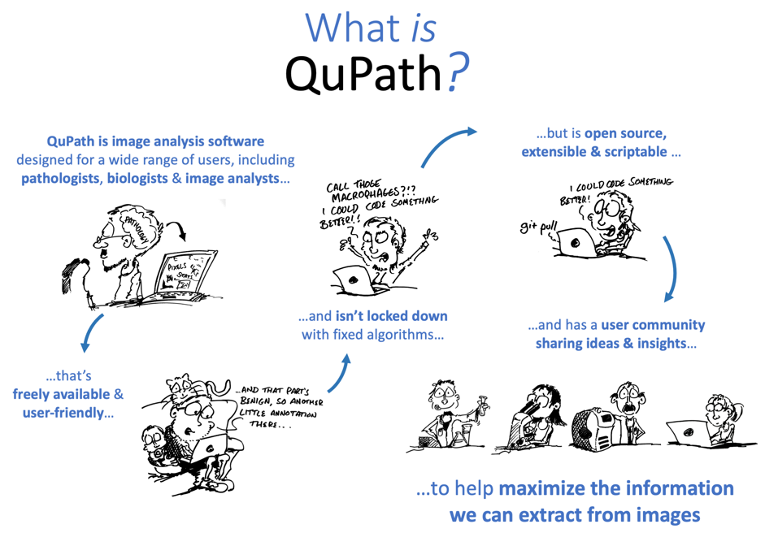

# QuPath Hackathon 2022

This is the discussion repo for the **first online QuPath hackathon, 26-29 April 2022**.

## What's the hackathon all about?

The goal of the hackathon is to bring together people who are **interested in QuPath from a *programmer's* perspective**.

**Be warned: it'll be technical!**

Most QuPath users who don't like coding aren't likely to find the discussions very interesting, useful or comprehensible.
Sorry.

This is to try to rebalance the training a bit.
QuPath's 'normal' use is already described in the [official docs](https://qupath.readthedocs.io/en/stable/), [YouTube channel](http://youtube.com/c/qupath) and [discussion forum](http://forum.image.sc/tag/qupath) - as well as fabulous user-created resources such as [Mike Nelson's website](https://www.imagescientist.com/image-analysis#qupath), the [La Jolla Institute workshop](https://www.youtube.com/playlist?list=PLlGXRBscPbCD89fRULm4peopF57qugciN) and the recent [SciLifeLab webinar](https://www.youtube.com/watch?v=WTAgXpuuqNY).

However, programmers who want to get the most out of QuPath don't have a lot.
They can [browse the source code](http://github.com/qupath/qupath) or the [javadocs](http://qupath.github.io/javadoc/docs/), but otherwise an excessive proportion of QuPath's *technical* documentation exists only in my leaky brain.

That's neither healthy for me nor for the project.
It's hard to keep on top of answering all the developer questions that come my way while [always being on the lookout for buses](https://en.wikipedia.org/wiki/Bus_factor).

This hackathon is intended to help more people understand QuPath at a technical level - so they can use it to do and develop new things.

## What's the goal?

The exciting thing (for me) about QuPath being open-source isn't just that it's free to use, but that it can be reused and recombined to help make even more interesting and useful open tools.

Some examples already include:

* [**Warpy**](https://forum.image.sc/t/warpy-registration-of-whole-slide-images-at-cellular-resolution-with-fiji-and-qupath/61803) & [**ImageCombinerWarpy**](https://forum.image.sc/t/imagecombinerwarpy-overlaying-registered-images-in-qupath/61804) for whole slide image registration
* [**paquo**](https://github.com/bayer-science-for-a-better-life/paquo) for combining QuPath + Python
* [**clupath**](https://github.com/clij/clupath) as a bridge between QuPath and [clij](https://clij.github.io) for GPU-powered processing
* [**QuPath Edu**](https://github.com/yli-hallila/qupath-edu-extension) for using QuPath in teaching
* [**QuPath Extension OpenVINO**](https://github.com/dkurt/qupath-extension-openvino) for using QuPath with [Intel OpenVINO for Java](https://github.com/openvinotoolkit/openvino_contrib/tree/master/modules/java_api)
* [**QuPath Extension CellPose**](https://github.com/BIOP/qupath-extension-cellpose) to bring [CellPose](https://github.com/MouseLand/cellpose) segmentation to QuPath
* [**NoCodeSeg**](https://github.com/andreped/NoCodeSeg) for using QuPath with [DeepMIB](http://mib.helsinki.fi/downloads.html) and [FastPathology](https://github.com/AICAN-Research/FAST-Pathology)

The goal of the hackathon is to make more work like this possible - and to have a larger group of people understanding QuPath's code, so we can share ideas about its future development.

## How will it work?

**It depends who joins!**

It should be **informal**.

At a most basic level, the hackathon will be me hanging around image.sc island for 4 days from ~9am-5pm BST, hoping I can make myself useful.

But if others join then there can also be networking and discussion.
I'll try to answer questions about QuPath's design, and we can talk about potential improvements - however the main focus will be on helping one another create or improve new QuPath extensions and scripts.

With that in mind, if you want to participate, **you should already have an idea what you want to do.**

For example, this could be:

* Integrate QuPath with some other tool
* Add a new feature as an extension
* Address some specific annoyance in the software
* Streamline analysis in a complex script
* Import/export data in a new way

If you have strong coding skills but no specific project of your own, you could also join to contribute to the work of others.

## Do I need to know Java or Groovy?

Not necessarily - but you should be comfortable programming in *some* language.

QuPath is written in Java and scripted with Groovy, but the hackathon isn't really concerned with developing QuPath itself.

If you're a Python, R or C++ aficionado (for example) and want to link up your work with QuPath, that all fits.

## How do I join?

Thanks to [@jni](https://github.com/jni), we'll be using **image.sc Island Gather.Town virtual space**, which is kindly sponsored by Gather.

It's the same space as has been used for other events by projects affiliated with the [**Scientific Community Image Forum** at image.sc](https://forum.image.sc).

To join, you should first sign up for one of the two **QuPath: Past, Present & Future** webinars on 25 April 2022:
* XXLink to be addedXX
* XXLink to be addedXX

There you can select that you want to join the hackathon as well.
If you do, you'll be emailed more details later.

You can then head over to [**Discussions**](https://github.com/qupath/2022-qupath-hackathon/discussions) to write a bit about what you want to achieve.

> **Important!** Numbers on image.sc island are limited, so please do write a few sentences describing why you want to participate.
> I hope everyone who wants to will be able to join - but in case it's badly oversubscribed, preference will be given to applicants planning to develop new scripts/extensions that will be open-source and useful to the wider community.

## What if I can't join for the whole thing?

**That's fine!**

Four days is a lot.
Timezones and other commitments will make things tricky.

However, because space on the island is limited, please don't sign up unless you *really* plan to join for at least a day or two.

## How do I find out more?

You can find more information on [**Discussions**](https://github.com/qupath/2022-qupath-hackathon/discussions).

If you want to contact me directly, you can find me on image.sc at https://forum.image.sc/u/petebankhead/

## License

Any content on this repo is really just for information and discussion.
Unless otherwise stated (e.g. in the header of a specific script), it's available under a [Creative Commons Zero (Public Domain)](https://creativecommons.org/publicdomain/zero/1.0/) license.

Note that this doesn't apply to QuPath itself, which is under [The GNU General Public License v3.0](https://www.gnu.org/licenses/gpl-3.0.en.html).
See https://github.com/qupath/qupath for information about QuPath license.
